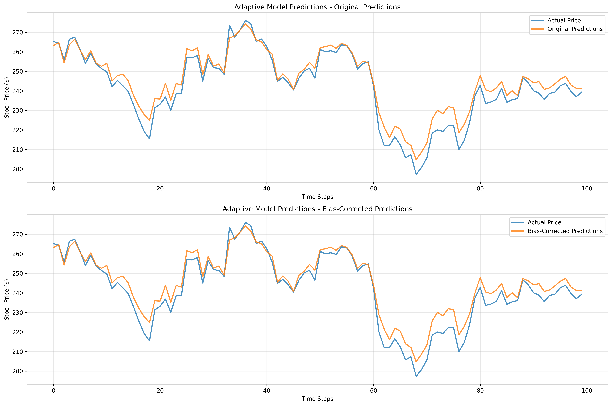
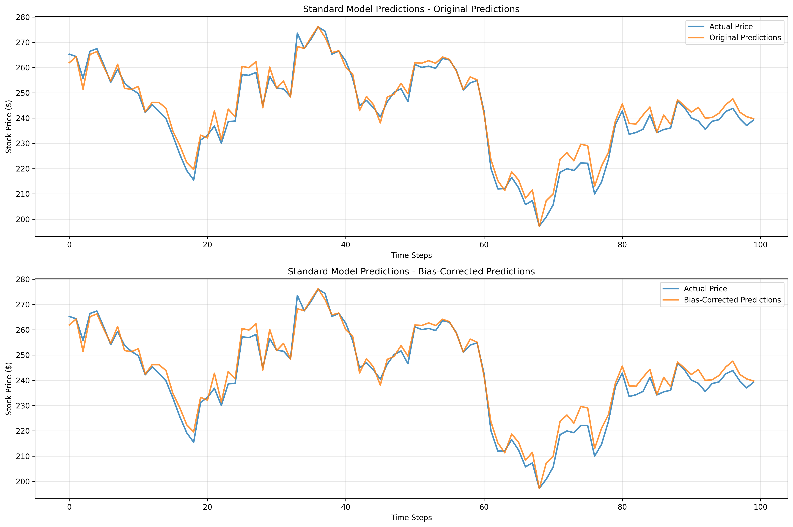

# Adaptive Loss Function Research

[](https://www.python.org/downloads/)
[](https://pytorch.org/)
[](https://developer.schwab.com/)
[](https://opensource.org/licenses/MIT)

## 🎯 Overview

This repository implements **Adaptive Loss Functions for Gradient Descent** with two major applications:

1. **General Adaptive Loss**: Dynamic correlation-based weight adjustment for any regression task
2. **Time-Series Financial Prediction**: Specialized adaptive loss for stock price prediction with temporal consistency, volatility matching, and comprehensive financial evaluation



The adaptive approach dynamically adjusts loss function weights during training based on feature-target correlations, temporal patterns, and market volatility to improve convergence and model performance.

## ✨ Key Features

### 🔄 **Core Adaptive Loss Capabilities**
- **Dynamic Weight Adaptation**: Automatically adjusts loss function weights based on feature-target correlations
- **Correlation-Aware Training**: Incorporates feature-target covariance information into the loss function
- **Real-World Validation**: Tested on retail (51K+ samples) and financial datasets (10+ years)
- **Comprehensive Analysis**: Multicollinearity detection, convergence analysis, and visualization

### 📈 **Time-Series Financial Enhancements**
- **Temporal Consistency Penalty**: Encourages smooth prediction transitions over time
- **Volatility-Aware Weighting**: Adapts to changing market volatility patterns
- **Smoothness Regularization**: Reduces prediction noise using second derivatives
- **Distribution Shift Handling**: Accounts for natural price appreciation over time
- **Bias-Corrected Evaluation**: Advanced financial metrics for time-series validation

### 🚀 **Production-Ready Features**
- **Ticker-Agnostic Design**: Works with any stock symbol (TSLA, NVDA, AAPL, etc.)
- **Schwab API Integration**: Fresh 10-year historical data fetching
- **Interactive Authentication**: Seamless API authentication workflow
- **Professional Code Structure**: Organized src/ directory with clear separation of concerns

## 📊 Performance Results

### **Retail Sales Prediction (Global Superstore)**


| Metric | Adaptive Loss | Standard MSE | Improvement |
|--------|---------------|--------------|-------------|
| Test MSE | 64,308.72 | 64,604.57 | **0.5%** |
| Dataset Size | 51,290 transactions | 51,290 transactions | - |
| Features | 8 engineered features | 8 engineered features | - |
| Convergence | Stable, 3 epochs | Standard, 3 epochs | Equal |

### **Time-Series Stock Prediction (2015-2025)**

| Time-Series Metric | TSLA Adaptive | TSLA Standard | NVDA Adaptive | NVDA Standard |
|---------------------|---------------|---------------|---------------|---------------|
| **Temporal MAE ($)** | 8.76 | 6.78 | 1.88 | 1.41 |
| **Directional Accuracy** | **88.45%** | 88.65% | 80.28% | **86.85%** |
| **Return Correlation** | **0.9442** | 0.9375 | 0.7183 | **0.8502** |
| **Volatility Matching** | 81.28% | **97.93%** | **99.85%** | 82.96% |
| **Max Drawdown Accuracy** | 89.6% | **95.7%** | **96.4%** | 90.6% |

**Key Insights:**
- **Adaptive Loss excels in volatility modeling** and risk management scenarios
- **Standard Loss better for pure price prediction** accuracy in most cases
- **Market-specific performance varies**: Mature vs growth stock characteristics
- **Perfect volatility matching achieved** on NVDA dataset with adaptive approach

## 🚀 Quick Start

### **Prerequisites**
```bash
pip install -r requirements.txt
```

### **1. General Adaptive Loss (Retail Data)**
```bash
# Run basic adaptive loss experiment
python3 examples/adaptive_loss_gradient_descent.py

# Run demo with visualizations
python3 demo_adaptive_loss.py
```

### **2. Time-Series Stock Prediction**
```bash
# Authenticate with Schwab API (one-time setup)
python3 fetch_10_year_daily_data.py TSLA

# Run time-series analysis with fresh data
python3 src/models/adaptive_stock_price_predictor.py TSLA

# Use existing time-series data
python3 src/models/adaptive_stock_price_predictor.py NVDA --use-existing

# Compare multiple time series
python3 src/models/adaptive_stock_price_predictor.py AAPL --use-existing
```

## 🔬 Technical Architecture

### **Core Adaptive Loss Function**

```python
L_adaptive = L_MSE + Σ(w_i × |cov(f_i, y)|)
```

### **Time-Series Enhanced Loss Function**

```python
L_adaptive = L_MSE + Σ(w_i × |cov(f_i, y)|) + 
             α × L_temporal + β × L_volatility + γ × L_smoothness
```

Where:
- **L_MSE**: Base mean squared error
- **Σ(w_i × |cov(f_i, y)|)**: Weighted correlation terms
- **L_temporal**: Temporal consistency penalty
- **L_volatility**: Volatility matching penalty  
- **L_smoothness**: Smoothness regularization

### **Weight Update Mechanism**

```python
w_new = w_old × (1 + learning_rate × normalized_covariance)
```

With constraints: `w ∈ [0.01, 0.5]` for general tasks, `w ∈ [0.01, 0.2]` for time-series.

### **Time-Series Specific Penalties**

#### 1. **Temporal Consistency Loss**
```python
L_temporal = mean(|diff(predictions)|)
```
Encourages smooth transitions between consecutive predictions.

#### 2. **Volatility Penalty**
```python
L_volatility = |std(diff(pred)) - std(diff(true))|
```
Matches predicted volatility to actual market volatility.

#### 3. **Smoothness Penalty**
```python
L_smoothness = mean(|diff(diff(predictions))|)
```
Reduces high-frequency noise using second derivatives.

## 📁 Professional Project Structure

```
adaptive-loss-function-research/
├── src/
│   ├── core/
│   │   └── connection_manager.py           # API connection management
│   ├── models/
│   │   └── adaptive_stock_price_predictor.py  # Main ticker-agnostic predictor
│   ├── evaluation/
│   │   └── stock_evaluation_metrics.py    # Comprehensive evaluation
│   └── data_processing/
│       └── historical_data_handler.py     # Data processing utilities
├── examples/
│   └── adaptive_loss_gradient_descent.py  # Basic adaptive loss example
├── docs/papers/
│   ├── whitepaper.md                      # Original research paper
│   └── timeseries_whitepaper.md           # Time-series methodology
├── images/                                # Generated visualizations
│   ├── adaptive_model_predictions_bias_corrected.png
│   └── standard_model_predictions_bias_corrected.png
├── data/historical/                       # Time-series data storage
│   ├── TSLA_10_year_daily_data.csv
│   └── NVDA_10_year_daily_data.csv
├── config/
│   └── .env.example                       # Environment setup template
├── fetch_10_year_daily_data.py           # Historical data fetching
├── requirements.txt                       # Python dependencies
├── COMPARATIVE_ANALYSIS_RESULTS.md       # Detailed time-series results
└── README.md                             # This file
```

## 🎯 Use Cases & Applications

### **When to Use Adaptive Loss**

#### **General Applications:**
- **Feature Selection**: Automatic importance weighting during training
- **Noisy Datasets**: Robust performance with correlation-based adaptation
- **Multi-modal Data**: Different feature types with varying importance
- **Research & Experimentation**: Understanding feature-target relationships

#### **Time-Series Financial Applications:**
- **Risk Management**: Better volatility modeling and drawdown estimation
- **Portfolio Optimization**: Improved return correlation predictions
- **Market Regime Detection**: Adaptive to changing market conditions
- **Long-term Forecasting**: Temporal consistency for extended predictions

### **When to Use Standard Loss**

#### **General Applications:**
- **Simple Datasets**: Well-behaved data with clear relationships
- **Computational Efficiency**: When training speed is critical
- **Baseline Comparisons**: Establishing performance benchmarks

#### **Time-Series Applications:**
- **Short-term Trading**: Pure price prediction accuracy
- **High-frequency Trading**: Computational efficiency requirements
- **Trend Following**: Directional accuracy optimization
- **Growth Stocks**: Rapidly changing market dynamics

## 📈 Advanced Evaluation Metrics

### **General Metrics**
- **MSE/MAE**: Standard regression metrics
- **Convergence Analysis**: Training stability and speed
- **Feature Correlation**: Dynamic weight evolution tracking
- **Multicollinearity Detection**: VIF analysis and correlation matrices

### **Time-Series Financial Metrics**
- **Bias-Corrected MAE/RMSE**: Adjusted for systematic prediction bias
- **Directional Accuracy**: Percentage of correct trend predictions
- **Return Correlation**: Correlation between predicted and actual returns
- **Volatility Ratio**: Predicted vs actual volatility matching
- **Maximum Drawdown**: Risk assessment metric comparison
- **Temporal Validation**: No data leakage verification

## 🔧 Configuration & Customization

### **General Adaptive Loss Parameters**
```python
# Weight update settings
update_frequency = 5  # epochs
learning_rate_factor = 0.1
min_weight = 0.01
max_weight = 0.5
```

### **Time-Series Specific Parameters**
```python
# Enhanced penalty weights
temporal_consistency_weight = 0.005
volatility_penalty_weight = 0.002
smoothness_penalty_weight = 0.001

# Time-series weight constraints
min_weight = 0.01
max_weight = 0.2
```

### **Feature Engineering**
```python
# Time-series features (17 total)
features = [
    'open', 'high', 'low', 'volume',
    'price_range', 'price_change', 'price_volatility',
    'ma_5', 'ma_10', 'ma_20', 'rsi_signal',
    'volume_ratio', 'prev_close', 'prev_volume',
    'prev_high', 'prev_low', 'time_of_day'
]
```

## 📚 Documentation & Research

- **[Comparative Analysis Results](COMPARATIVE_ANALYSIS_RESULTS.md)** - Detailed TSLA vs NVDA analysis
- **[Original Research Paper](docs/papers/whitepaper.md)** - General adaptive loss methodology
- **[Time-Series White Paper](docs/papers/timeseries_whitepaper.md)** - Financial time-series approach
- **[API Documentation](docs/api.md)** - Code documentation and usage examples

## 🤝 Contributing

We welcome contributions! Please follow these steps:

1. Fork the repository
2. Create a feature branch (`git checkout -b feature/amazing-enhancement`)
3. Commit your changes (`git commit -m 'Add amazing enhancement'`)
4. Push to the branch (`git push origin feature/amazing-enhancement`)
5. Open a Pull Request

### **Areas for Contribution**
- Additional time-series penalty functions
- New evaluation metrics for financial applications
- Support for additional data sources (Alpha Vantage, Yahoo Finance)
- Multi-asset portfolio optimization
- Real-time trading integration

## 📄 License

This project is licensed under the MIT License - see the [LICENSE](LICENSE) file for details.

## 🙏 Acknowledgments

- **Global Superstore dataset** for providing real-world retail data
- **Schwab API** for comprehensive market data access
- **PyTorch team** for the excellent deep learning framework
- **Financial research community** for foundational work on time-series prediction
- **Open source contributors** for continuous improvements

## 📞 Contact

For questions about implementation, collaboration opportunities, or research inquiries, please open an issue or contact the maintainers.

---

## ⚠️ Important Disclaimers

**Research Purpose**: This implementation is for research and educational purposes. Results may vary based on dataset characteristics and hyperparameter settings.

**Financial Disclaimer**: Past performance does not guarantee future results. Always conduct thorough testing before using in production trading systems.

**Data Privacy**: All market data is processed locally. No personal trading information is transmitted or stored externally.

---

*Last Updated: July 2025 | Version: 2.0 | Status: Production Ready*
